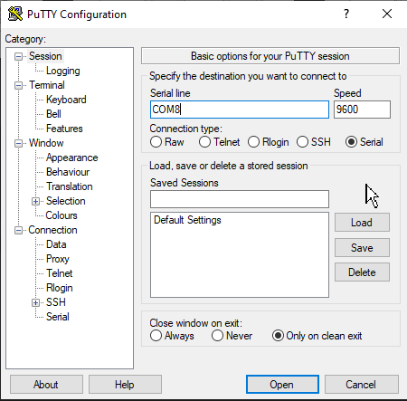
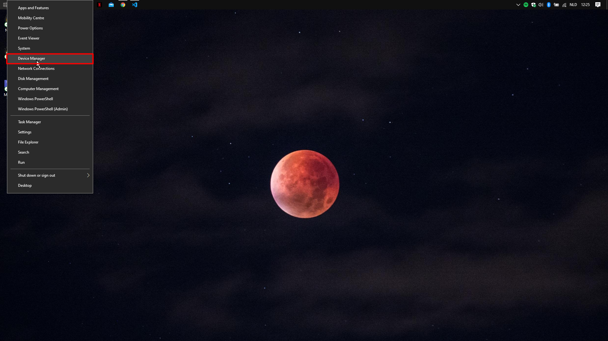
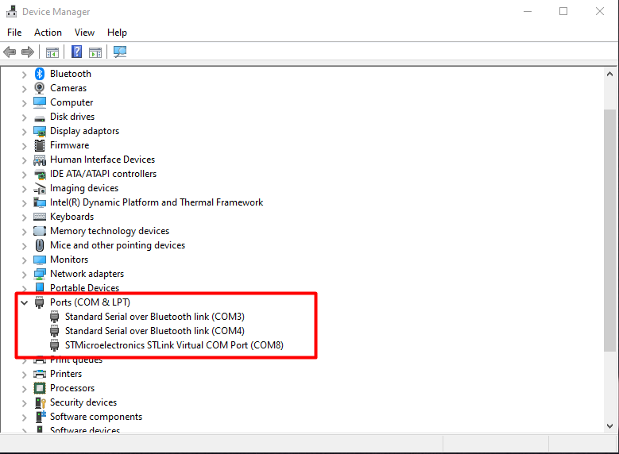
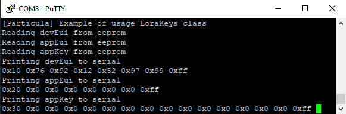

# Eeprom LoraWAN Keys class

In this repo you will find classes so you can write/read lorawan keys (or any array you want) to an eeprom.

## Installing software

For using this eeprom you have to have the following software installed:

* Visual Studio Code
* Mbed CLI
* Putty (to test the code)

## How to use

Fill these lines in the terminal after cloning this repo. Because we're using an eeprom to write/read the lorawan tokens we're using a driver specifically made for this eeprom thats what the mbed add is for.

```bash
mbed new .
mbed deploy
mbed add git@github.com:vives-projectwerk-2-2020/Driver_EEPROM.git
mbed toolchain GCC_ARM
mbed target detect
mbed compile -f
```
## Example
Make a main.cpp file in the root directory and copy this code in it. With this code we're just calling to the classes that read and write the keys. You can find this code in the directory EepromLoraWANKeys/examples

```cpp
#include "mbed.h"
#include "LoraKeys.h"
Serial pc(USBTX, USBRX);


int main()
{
    pc.printf("\r\n[Particula] Example of usage LoraKeys class");

    struct LoRaWAN::LoRaWANKeys lora_keys = {
        {0x10, 0x76, 0x92, 0x12, 0x52, 0x97, 0x99, 0xFF},                                                // devEui
        {0x20, 0x00, 0x00, 0x00, 0x00, 0x00, 0x00, 0xFF},                                                // appEui
        {0x30, 0x00, 0x00, 0x00, 0x00, 0x00, 0x00, 0x00, 0x00, 0x00, 0x00, 0x00, 0x00, 0x00, 0x00, 0xFF} // appKey
    };

        

    LoRaWAN::Keys keys(lora_keys); //saving keys to eeprom

    char * devEui;
    char * appEui;
    char * appKey;

    pc.printf("\r\nReading devEui from eeprom");

    devEui = keys.read_devEui();
    
    
    pc.printf("\r\nReading appEui from eeprom");

    appEui = keys.read_appEui();

    pc.printf("\r\nReading appKey from eeprom");

    appKey = keys.read_appKey();
   
    pc.printf("\r\nPrinting devEui to serial\r\n");
    for(unsigned int i = 0; i < 8; i++){
        pc.printf("0x%x ", devEui[i]);
    }

    pc.printf("\r\nPrinting appEui to serial\r\n");
    for(unsigned int i = 0; i < 8; i++){
        pc.printf("0x%x ", appEui[i]);
    }

    pc.printf("\r\nPrinting appKey to serial\r\n");
    for(unsigned int i = 0; i < 16; i++){
        pc.printf("0x%x ", appKey[i]);
    }

    return 0;
}
```

## How to test the driver

Make sure you have Putty installed for this.

Before compiling the code open Putty up. You will be greeted with the following window:



Select Serial and select the com your eeprom is connected to, if you don't know this, do the following:

Right-click the windows icon and select Device Manager


Locate the ports section and look what your eeprom is connected to, in my case its COM8.


After all this select Open in Putty and compile the code using ```mbed compile -f``` in the terminal.



If everything worked correctly you should see we were able to write our lorawan keys to the eeprom.